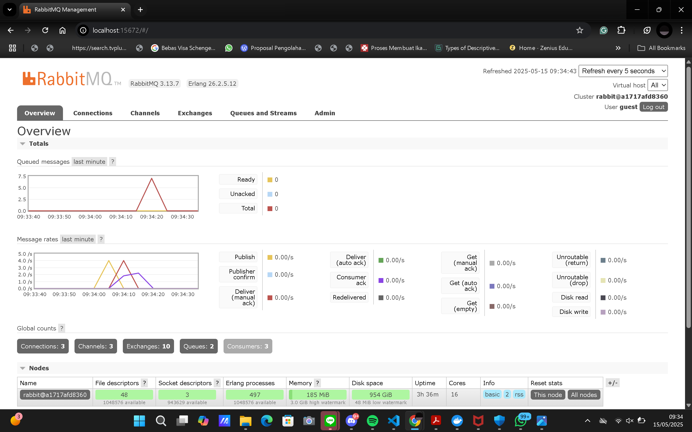
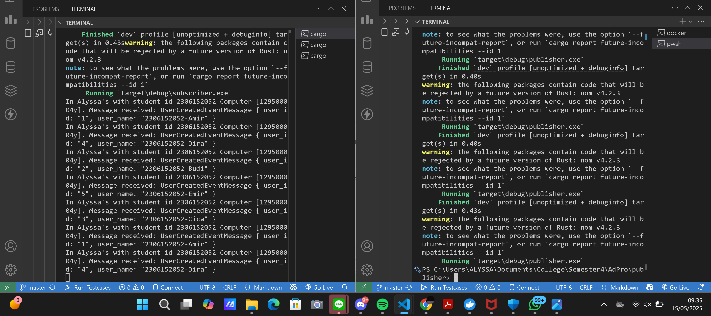
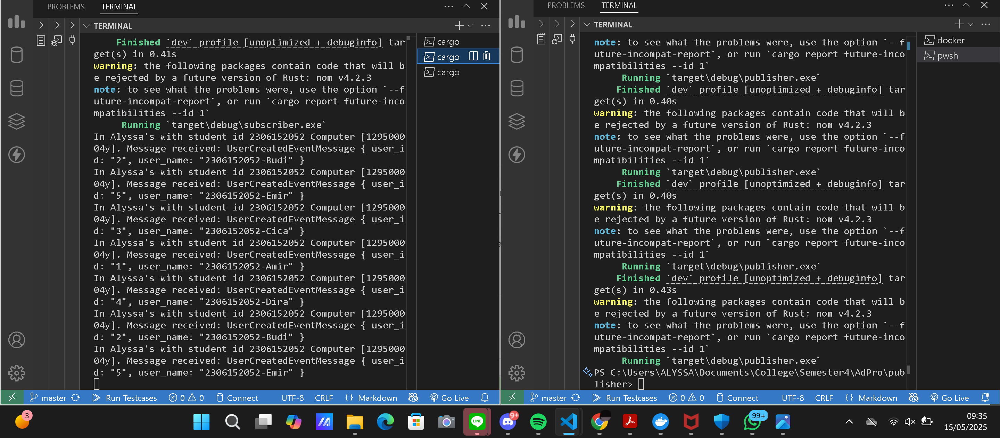
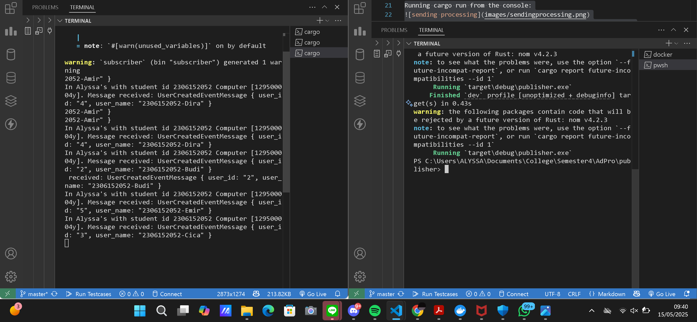

**Nama**: Alyssa Layla Sasti    
**Kelas**: AdPro B   
**NPM**: 2306152052  

## REFLECTION MODULE 9 SUBSCRIBERc
1. What is amqp?
    - AMQP (Advanced Message Queuing Protocol) adalah sebuah protokol komunikasi terbuka yang dirancang untuk sistem message-oriented middleware. Dengan kata lain, AMQP digunakan untuk mengirim dan menerima pesan antar aplikasi atau komponen sistem secara asinkron melalui message broker seperti RabbitMQ. Saya memahami bahwa AMQP memungkinkan aplikasi-aplikasi untuk saling bertukar informasi (pesan) dengan cara yang aman dan terpisah secara logis. Hal ini berguna terutama ketika dua sistem atau layanan tidak dijalankan secara bersamaan (misalnya, satu layanan mengirim data dan layanan lain menerima saat tersedia).
2. What does it mean? guest:guest@localhost:5672, what is the first guest, and what is the second guest, and what is localhost:5672 is for?
    - guest:guest adalah format username:password untuk login ke broker AMQP. Dalam hal ini:
        - guest pertama adalah username default
        - guest kedua adalah password default
    - localhost menunjukkan bahwa koneksi dilakukan ke server lokal (komputer saya sendiri) di mana broker seperti RabbitMQ berjalan.
    - 5672 adalah port default yang digunakan oleh RabbitMQ untuk menerima koneksi AMQP.
    - Jadi, keseluruhan guest:guest@localhost:5672 berarti saya mengakses RabbitMQ (yang berjalan di komputer lokal saya) menggunakan username dan password default melalui port 5672.

Simulation slow subscriber

Pada simulasi slow subscriber ini, saya meng-uncomment `thread::sleep(ten_millis);`. Kemudian saya melakukan `cargo build` dan `cargo run` sebanyak 4 kali dengan 1 console terminal. Setiap masing - masing cargo run mengirim 5 pesan. Hanya 3 yang terlihat di queue, karena yang pertama sudah diproses langsung. 3 cargo run x 5 pesan = 15 queue. Sehingga terlihat bahwa queue di mesin saya adalah 15. 

Reflection and Running at least three subscribers

Untuk kasus me-run 3 subscriber, terdapat queue yang lebih sedikit, yaitu sesuai grafik adalah 7,5. Hal ini dikarenakan terjadi load balance dari semua subscriber oleh pesan yang dikirim publisher. Untuk improve bisa dengan memperbaiki act handling menjadi lebih spesifik